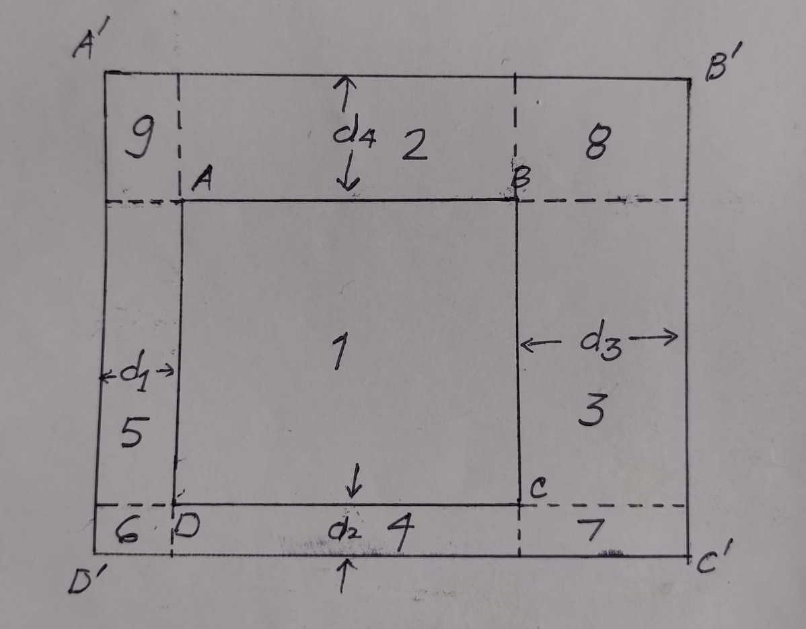

# Explanation

From the figure, we can easily see that the enlarged area can be easily divided into 9 sections.
- The initial Area ( 1 )
- Four areas with one side common with initial rectangle ( 2,3,4,5 ) - area would be the common length multiplied with di.
- Four areas with one corner commom ( 6,7,8,9 ) - area would be the multiplication of two di's.

`So total final area = Area(Initial) + d1*a1 + d2*a2 + d3*a3 + d4*a4 + d1*d2 + d2*d3 + d3*d4 +d1*d4 `

The C++ solution can be found [here](solve.cpp).

