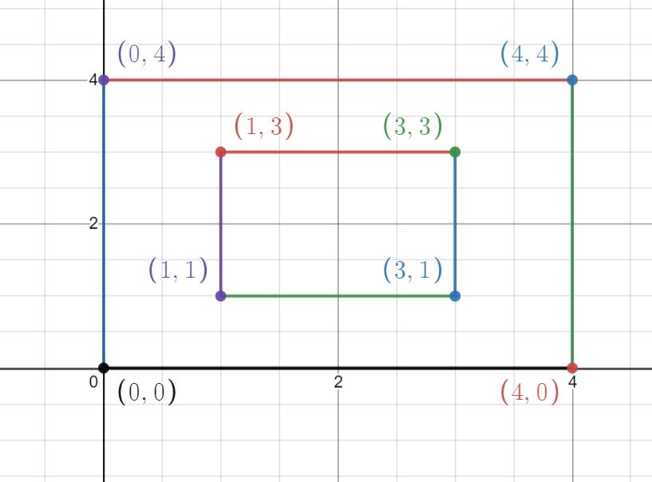

# 
Painter and Rectangles 

Time limit : 0.5 second 
Memory limit : 256 megabytes  

There is a competition between a painter and a robot to paint ( fill with colour ) a rectangle. Both robot and painter are filling the rectangular area such that at any instant of time the shape of the rectangle is not changing but it is just enlarging. All the sides of initial and final rectangle are respectively parallel and the perpendicular distance between them are `d``i`. At that instant the painter wants to know whether he has painted more area or not. 
You will be given the initial coordinates of the rectangle `( x``i` `, y``i`` )` and `d``i` for rectangles of both painter and robot.
## Input
The first 4 line will have the coordinates for the rectangle of painter and then a single line containing the value of `d``i``'s`.

The next 5 line will have the same data for 
the rectangle of robot.
### Constraints

 0 <= `d``i` , `x``i` , `y``i` <= 106
 - The coordinates and di's will be integer.
 - The coordinate will be in anticlockwise order.
 - di's will also be in anticlockwise order and will be in order with the coordinates.

## Output
You just need to print `BIG` for bigger rectangle of painter or else print `SMALL`.
> Note : If area comes to be equal then also print `BIG`.

## Sample Cases

### __Input__ 

1 1  
3 1  
3 3  
1 3  
1 1 1 1  
1 1  
3 1  
3 3  
1 3  
2 2 2 2

### __Output__ 

SMALL

### __Explanation__

  
This is the plot for the rectangle painted by the painter, so here we can see that all the `di's` are same therefore we got same enlargement in all sides. We can calculate the area of the rectangle and find the answer. 

